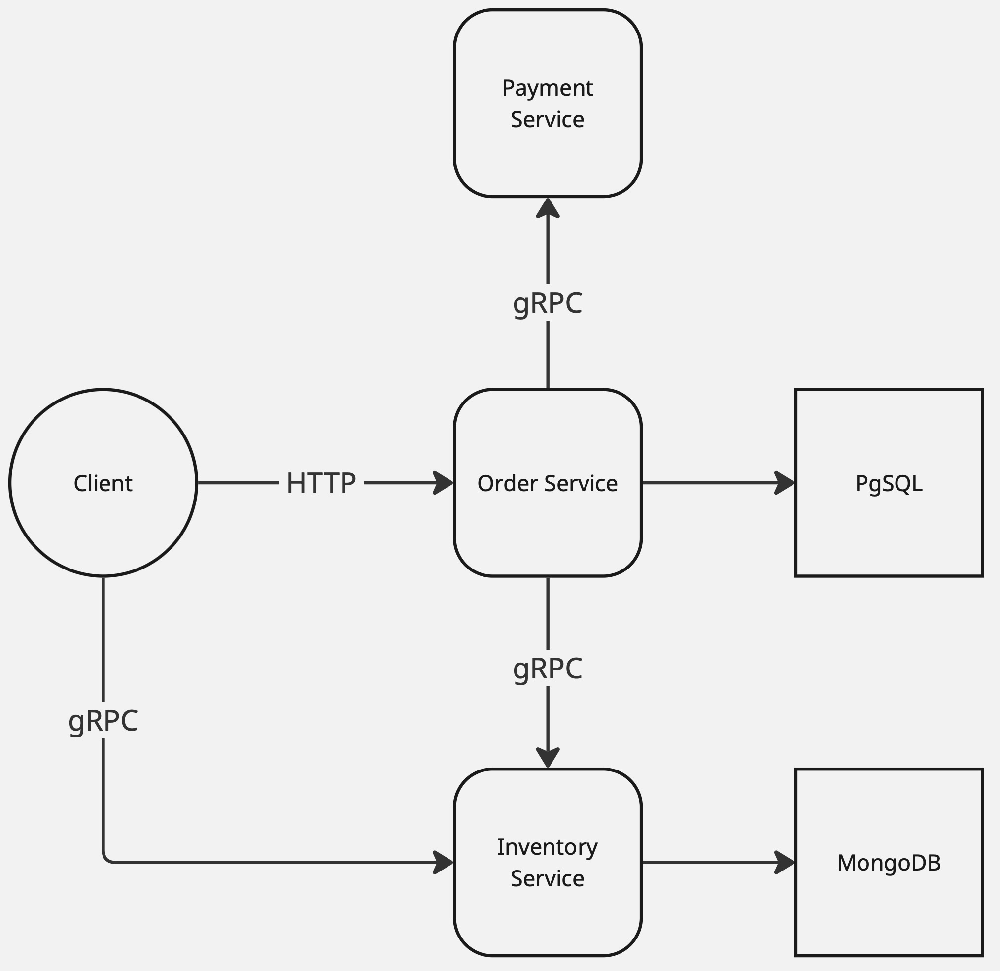

# Микросервисный маркетплейс

Микросервисная архитектура маркетплейса, включающая сервисы заказов, склада и платежей.

---

## Архитектура сервисов

### Order-Service (HTTP + OpenAPI)

Сервис управления заказами.

| Характеристика  | Значение   |
|-----------------|------------|
| Язык            | Go         |
| Протокол        | HTTP/REST  |
| Фреймворк       | Chi        |
| Codegen         | OpenAPI    |
| База данных     | PostgreSQL |
| Миграции        | goose      |
| Контейнеризация | Docker     |

**Функции:**
- создание, оплата, отмена заказа
- хранение информации о товаре
- вызов Inventory-Service (предоставление информации о товаре)
- вызов Payment-Service (оплата / отмена заказа)

---

### Inventory-Service (gRPC)

Сервис управления товарами.

| Характеристика | Значение |
|----------------|---------|
| Язык | Go |
| Протокол | gRPC |
| База данных    | MongoDB   |
| Контейнеризация | Docker     |

**Функции:**
- хранение каталога товаров
- хранение информации о товаре

---

### Payment-Service (gRPC)

Сервис обработки платежей.

| Характеристика | Значение |
|----------------|---------|
| Язык | Go |
| Протокол | gRPC |
| Контейнеризация | Docker     |

**Функции:**
- имитация платёжной обработки
- возврат результата транзакции

## CI/CD

Проект использует GitHub Actions для непрерывной интеграции и доставки. Основные workflow:

- **CI** (`.github/workflows/ci.yml`) - проверяет код при каждом push и pull request
  - Линтинг кода
  - Проверка безопасности
  - Выполняется автоматическое извлечение версий из Taskfile.yml
